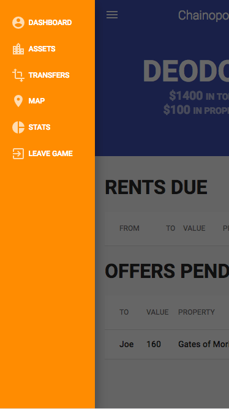
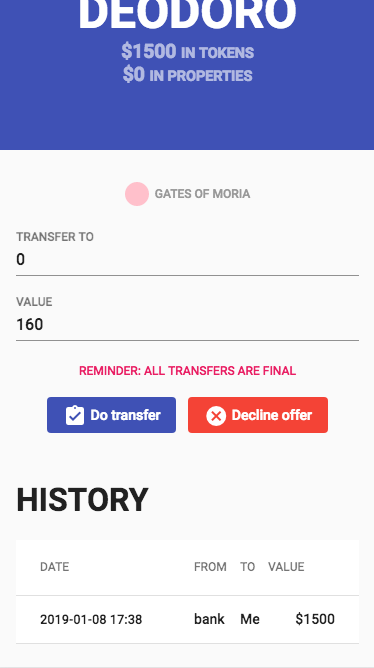
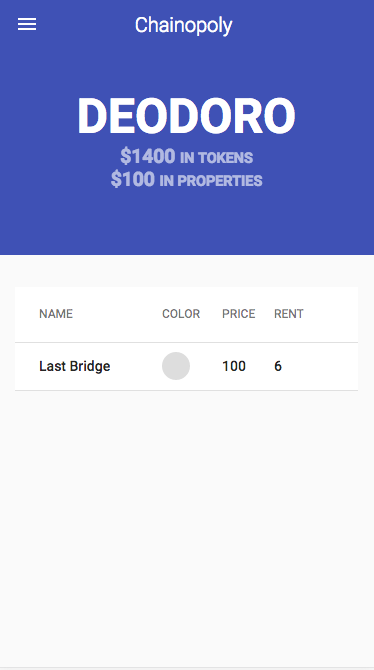

# Blockchain based monopoly game
By deodoro.filho@gmail.com. Please see LICENSE.txt attached.

# Introduction

This is work in progress, it is meant to used as an example project in a series of lectures about blockchain use cases.

In order to build the UI, I wrote a python backend server that emulates the blockchain calls.

# The game

This is a modified version of the classic monopoly board game, differences being:

* Players register in the game using an ethereum wallet;
* Once the second player is registered, the game starts;
* Additional players may join in at any round;
* At the beginning of the round, dices are rolled for each registered player, their positions are updated, and a set of invoices (i.e. a player landed in a property owned by another player) and offers (i.e. a player landed in a property owned by the bank) are created;
* Offers may be declined;
* Once players create transactions (or declinations) that clear all rents and offers in a round, a new round is automatically fired;
* Any player may leave at any times, her properties and credits are transferred back to the bank

# Screenshots

### Player registration

### Players may access functionalities at any time

### The dashboard presents which offers and invoices are pending at any moment

### If a user touches an offer to her or an invoice of a rent she owes, transaction data is automatically filled

### A map shows all properties

### The list of properties the player owns, one may touch a property to view its information

### This screen shows some useful statistics about what may happen in the next round

### A player may leave the game at any time

# A few details

* Properties are declared in a JSON file (server/assets). Right now, their names are taken from locations in the *Lord of the Rings* world;
* In the DAPP version, each property info is stored in a separate smart contract, which is connected at deploy to its unfungible token;
* By creating offers, the bank temporality transfers property ownership the the atomic_swap contract;
